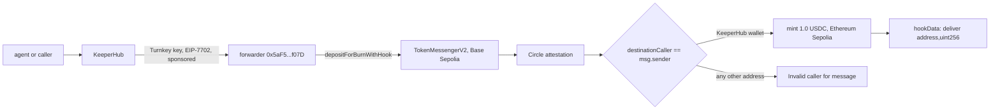

# Berth

**1.0 USDC was burned on Base Sepolia. Exactly one address on Ethereum Sepolia was permitted to mint it, and that address is a KeeperHub wallet.**

[](https://github.com/Cassxbt/berth/actions/workflows/verify.yml)


[Judge it in 90 seconds](#judge-it-in-90-seconds) · [npm run verify](#npm-run-verify) · [Honesty](#honesty) · [What still breaks](#what-still-breaks)

## The window where the money exists nowhere

A CCTP burn is irreversible the moment it lands. From that block until someone calls `receiveMessage` on the destination chain, the USDC exists on neither chain, and by default **any address may be the one to call it**: `destinationCaller` is optional, and almost every integration leaves it `bytes32(0)`. That is the window. The value is committed, and whoever shows up first completes it.

Berth closes the window to one address.

## One mechanism

When Berth burns, it sets `destinationCaller` to the KeeperHub-custodied wallet and packs a `deliver(address,uint256)` call into `hookData`. Circle's documentation is explicit that it will not run that hook — *"Hook execution is left entirely to the integrator"* — and `TokenMessengerV2._handleReceiveMessage` reads `mintRecipient`, `burnToken`, `amount` and `fee`, and never reads `hookData` at all. So KeeperHub is the only party permitted to mint, and the same execution path is the one that can run the instruction Circle declines to run.

> **Without KeeperHub there is no address permitted to mint this USDC. The burn is irreversible; the mint is exclusive.**

Berth did not write the code that enforces this. `require(destinationCaller == msg.sender, "Invalid caller for message")` lives in Circle's own deployed, audited `MessageTransmitterV2`. We supply the argument; Circle's contract supplies the refusal. **There is no Solidity in this repository** — see [Why no contract](#why-no-contract).

## Judge it in 90 seconds

No wallet, no keys, no clone required for steps 1 to 3.

**1. The burn, executed and gas-sponsored through KeeperHub.**
[`0xd1a6fe7e…026414`](https://sepolia.basescan.org/tx/0xd1a6fe7e3d3f4e945e5c03d3911dcb678c6ba1eedad2e574b4eb2ce5df026414) on Base Sepolia. `to` is the KeeperHub sponsored forwarder `0x5aF5194B…f07D`; `from` is KeeperHub's relayer. The wallet that owns the USDC, `0x3db6f359…0cb2`, holds **0 ETH on both chains** and appears nowhere in the fee path.

**2. The mint, also through KeeperHub.**
[`0xf69a9b4f…a6690a`](https://sepolia.etherscan.io/tx/0xf69a9b4f4b8e685c7ed2e6d693358bcfdb2fab57521bf1b247d3b75ecaa6690a) on Ethereum Sepolia. 1.000000 USDC minted.

**3. Reproduce the refusal yourself.** Same message, same attestation, only the caller differs:

```bash
MSG=$(curl -s "https://iris-api-sandbox.circle.com/v2/messages/6?transactionHash=0xd1a6fe7e3d3f4e945e5c03d3911dcb678c6ba1eedad2e574b4eb2ce5df026414" | jq -r .messages[0].message)
ATT=$(curl -s "https://iris-api-sandbox.circle.com/v2/messages/6?transactionHash=0xd1a6fe7e3d3f4e945e5c03d3911dcb678c6ba1eedad2e574b4eb2ce5df026414" | jq -r .messages[0].attestation)

cast call 0xE737e5cEBEEBa77EFE34D4aa090756590b1CE275 "receiveMessage(bytes,bytes)(bool)" "$MSG" "$ATT" \
  --from 0x000000000000000000000000000000000000dEaD --rpc-url https://ethereum-sepolia-rpc.publicnode.com
# execution reverted: Invalid caller for message

cast call 0xE737e5cEBEEBa77EFE34D4aa090756590b1CE275 "receiveMessage(bytes,bytes)(bool)" "$MSG" "$ATT" \
  --from 0x3db6f359d9219f0c7348e20481c08e8440220cb2 --rpc-url https://ethereum-sepolia-rpc.publicnode.com
# execution reverted: Nonce already used
```

The second call reverts differently because the mint already happened. Before it, that same call returned `true`. The caller check sits **above** the nonce check in `_validateReceivedMessage`, so the gate keeps refusing every other address permanently — settling the transfer did not erase the proof.

**4. Check the whole claim yourself.** `npm run verify` — 21 assertions, no credentials.

## npm run verify

```
berth verify — claims claims.json
Base Sepolia      head=46970643
Ethereum Sepolia  head=11728684

[ok]   A01  burn transaction succeeded
[ok]   A02  burn routed through the KeeperHub forwarder
[ok]   A03  forwarder selector is execute(address,address,uint256,bytes)
[ok]   A04  burn was executed for the KeeperHub wallet against TokenMessengerV2
[ok]   A05  inner call is depositForBurnWithHook
[ok]   A06  sponsored authorisation had not expired when it executed
[ok]   A07  burn emitted exactly one MessageSent
[ok]   A08  destinationCaller in the on-chain message is the KeeperHub wallet
[ok]   A09  burn body matches the claimed amount and recipient
[ok]   A10  message carries a hook Circle does not execute
[ok]   A11  Circle has attested the burn
[ok]   A12  Circle rewrote only the nonce and executed finality threshold
[ok]   A13.1 any other caller is refused: 0x…dEaD
[ok]   A13.2 any other caller is refused: 0xd8dA6BF2…6045
[ok]   A13.3 any other caller is refused: 0x…0001
[ok]   A14  nonce is spent, so the mint executed
[ok]   A15  minted USDC is present on the destination
[ok]   A16  mint was also a KeeperHub sponsored execution
[ok]   A17  wallet is an EIP-7702 delegated account on both chains
[ok]   A18  forwarder is the same deployed code on both chains
[ok]   A19  batching through Multicall3 breaks the gate, so atomic mint-plus-hook is not available

21 ok   0 FAILED
```

Every number and address in this README is an assertion in `claims.json`. **If the README and the verifier disagree, the verifier is right.** A failing assertion prints claim, observed, source, and what it means, so a reader can tell whether the code is wrong or the claim is.

Exit codes distinguish two different things: `0` every claim holds, `1` a claim is false, `2` the RPC or Circle was unreachable and nothing was evaluated. A throttled runner is not evidence that a claim is wrong.

**The verifier is shown to fail.** `npm run verify:tamper` mutates `claims.json` five ways — wrong wallet, inflated amount, denying the mint happened, probing the permitted caller, wrong inner selector — and requires a non-zero exit on each.

```
[ok]   detected: wallet address off by one nibble
[ok]   detected: burn amount inflated by one unit
[ok]   detected: claims the mint has not executed
[ok]   detected: probes the permitted caller, expecting a refusal
[ok]   detected: wrong inner selector for the burn

5/5 lies detected
```

Both run in CI on every push and on a daily schedule, because these claims describe live chain state and can go stale without a commit.

## Counted evidence

| | |
|---|---|
| Value moved through the gate | 1.000000 USDC (`amount = 1000000`, 6 decimals) |
| Mints by any address other than the KeeperHub wallet | **0 — not permitted, not merely not attempted** |
| Distinct addresses shown to be refused, live | 3 |
| Live assertions, no credentials required | 21 |
| Deliberate lies the verifier catches | 5 of 5 |
| Unit tests, offline against committed fixtures | 6 |
| Chains the KeeperHub decoder handles | 2, same forwarder code on both (asserted, A18) |
| Completed transfers | **1.** Anything said about throughput would be projected, so nothing is said about it. |

## KeeperHub surfaces used

Only surfaces with a real call site are listed.

| Surface | Where | What it does here |
|---|---|---|
| Sponsored execution via the forwarder | `src/keeperhub/decode.ts` | `execute(address,address,uint256,bytes)` at `0x9aefaff8` on `0x5aF5194B…f07D`. Both the burn and the mint went through it, gas sponsored. |
| Turnkey key + EIP-7702 delegated wallet | asserted in `scripts/verify.ts` A17 | The wallet is `0xef0100` + `0x955d8413…22c6F` on both chains and holds no native balance. |
| Workflow executor API | used for the mint | `PATCH /api/workflows/{id}` to set exact arguments, then `POST /api/workflows/{id}/execute`. This path is gas-sponsored. |
| Direct execution API | used for the pre-flight | `POST /api/execute/contract-call` with `simulate: true` returned `wouldRevert: false` before anything was broadcast. |

Not used, and therefore not claimed: MCP, CLI, x402, MPP, agent-authored workflows.

## Reliability: the non-happy path

Three refusals, all reproducible by anyone, all enforced by Circle rather than by us. Each string was confirmed present in the deployed `MessageTransmitterV2` bytecode on both chains.

| Refusal | Condition | Reproduce |
|---|---|---|
| `Invalid caller for message` | caller is not the named `destinationCaller` | `eth_call` from any address (verifier A13) |
| `Nonce already used` | the transfer has already settled | `eth_call` from the permitted caller, now |
| `Invalid destination domain` | the message is offered to the wrong chain | `eth_call` the same message on Base Sepolia |

Ordering matters and is load-bearing: the caller check runs **before** the nonce check, which is why the exclusivity proof survives settlement instead of being replaced by it.

## Why no contract

The obvious design is a `HookExecutor` set as `mintRecipient` that receives the mint and runs the hook atomically. It cannot work: `TokenMessengerV2._handleReceiveMessage` mints and never calls back into the recipient, so such a contract would receive the funds and never execute.

The next obvious design is to batch the mint and the hook into one transaction. **That cannot work either, and the reason is the gate itself.** KeeperHub's batch node routes calls through Multicall3's `aggregate3`, which forwards each call, so `msg.sender` at the transmitter becomes Multicall3 rather than the named `destinationCaller`. Assertion A19 proves it live: the identical call, from the identical wallet, reverts `Invalid caller for message` when routed through Multicall3 and passes the gate when sent directly.

**A gated CCTP message cannot be minted from inside a batch.** Exclusivity and atomicity are mutually exclusive here, and exclusivity is the product. So delivery is two transactions: the gated mint, then the hook. The non-atomicity is bounded rather than open-ended, because no other party is permitted to mint in between.

Shipping no Solidity also keeps contributor-written code out of the value path, and keeps the exclusivity claim resting on Circle's audited contract rather than on a modifier we wrote.

## Architecture



## Honesty

| Claim | The honest limit |
|---|---|
| Network | Testnet only, Base Sepolia to Ethereum Sepolia. The value is testnet value; the contracts, addresses and enforcement are the production CCTP V2 deployments. |
| Gas | Every execution was sponsored by KeeperHub. The wallet holds 0 ETH and has never paid for its own gas, so the self-funded path is untested. |
| The exclusivity claim | Enforced against **on-chain callers**: no address other than `0x3db6f359…0cb2` can call `receiveMessage` for this message, and Circle's contract enforces it. It is **not** a claim about key custody. The wallet is a Turnkey-held EOA; a holder of that private key could mint without KeeperHub's execution path. We have not verified the key is non-exportable and do not claim it. What is proven is that the permitted caller set has size one. |
| The hook | The hook travelled end to end and is readable in the delivered message. **It has not been executed yet.** Atomic delivery turned out to be unavailable (see [Why no contract](#why-no-contract)), so the hook must run as a second transaction after the mint. That path is unbuilt. Berth proves exclusive permission and carries the instruction; it does not yet run it. |
| The decoder | The forwarder's blob layout is undocumented and was derived by observation across executions on two chains. A forwarder upgrade would invalidate it, and the verifier is written to fail loudly rather than decode garbage. |
| Scale | One transfer. The refusal path is reproducible without limit; the execution path is n=1. |

A testnet can show the mechanism holds. Only a mainnet burn would put something at stake.

## Run it yourself

```bash
git clone https://github.com/Cassxbt/berth && cd berth
npm install
npm test              # 6 offline tests against committed fixtures
npm run verify        # 21 live assertions, no credentials of any kind
npm run verify:tamper # proves the verifier can fail
npm run decode -- ethSepolia 0xf69a9b4f4b8e685c7ed2e6d693358bcfdb2fab57521bf1b247d3b75ecaa6690a
```

Only `npm run verify` needs the network, and it needs nothing else: no API key, no wallet, no `.env`. A KeeperHub API key is required only to execute new writes, and it is read from `.env`, which is gitignored and never read by the verifier.

## What still breaks

1. **The hook is carried, not executed.** We expected to deliver mint-and-hook atomically and found we cannot: batching rewrites `msg.sender` and the gate refuses it (A19). Delivery has to be two transactions, and the second one is unbuilt. If the mint lands and the hook then fails, the USDC is minted and the instruction is not executed — that recovery path does not exist yet.
2. **`POST /api/execute/contract-call` is not gas-sponsored while the workflow executor is.** The direct call failed with `Insufficient ETH balance. Have: 0.0` against a wallet that has executed many sponsored writes. The docs say writes "may be gas-sponsored" without saying which paths qualify. Filed upstream.
3. **The Write Contract UI could not carry a 890-byte `bytes` argument.** Typed input silently lost 128 characters, a retry added 7, a workflow JSON import did not overwrite the node and reported no error, and clearing the field with Backspace deleted the node from the canvas. The mint was ultimately executed by writing the node config through the REST API and verifying it by read-back. Filed upstream.
4. **Exclusivity is about callers, not custody.** See the honesty table. We looked for a way to prove Turnkey key non-exportability from outside and did not find one.
5. **One transfer, one corridor, one hook shape.** `deliver(address,uint256)` only. Multi-call hooks, and recovery when a mint lands but a hook does not, are unimplemented.
6. **No demo video yet.** Stated plainly rather than omitted.

## Layout

```
src/keeperhub/decode.ts   reconstructs any KeeperHub execution from a tx hash
src/cctp/message.ts       CCTP V2 codec, offsets taken from Circle's contracts
src/cctp/iris.ts          Circle attestation client
scripts/verify.ts         the 21 assertions
scripts/tamper.ts         proves the verifier fails on a false claim
fixtures/                 both copies of the live transfer, on-chain and attested
```

`src/keeperhub/decode.ts` knows nothing about CCTP. It decodes any KeeperHub sponsored execution on any chain, which is the part of this repository most worth reusing.

## Security

No key material is committed. `.env`, `*.key`, `*.pem` and local planning files are gitignored. The verifier reads no credentials, which is why a judge can run it.

## License

MIT.
